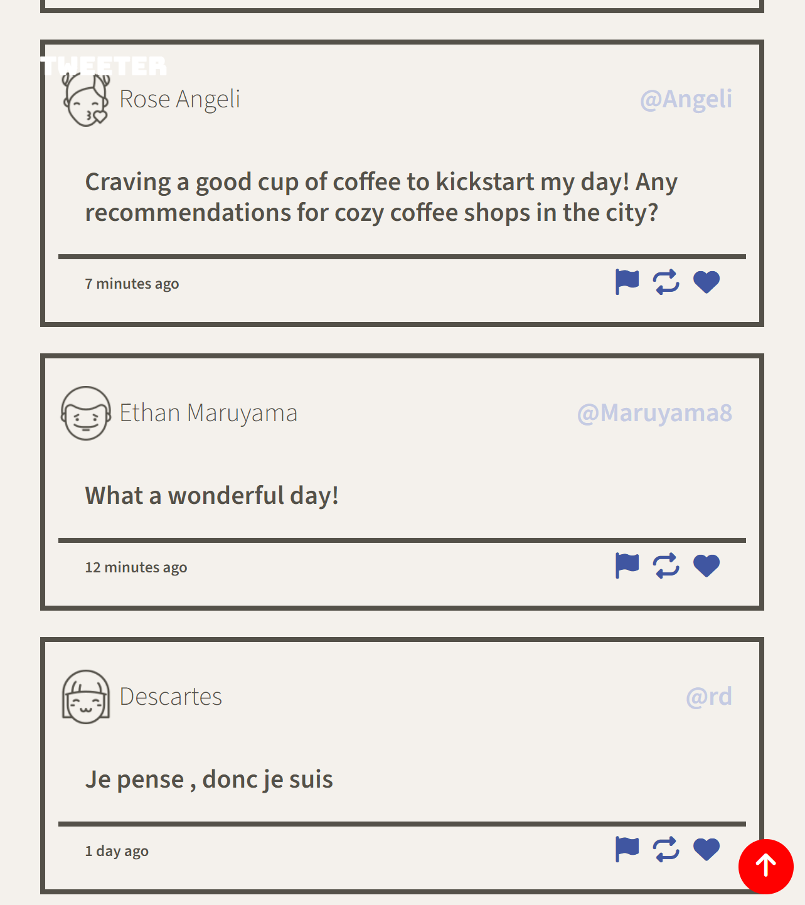
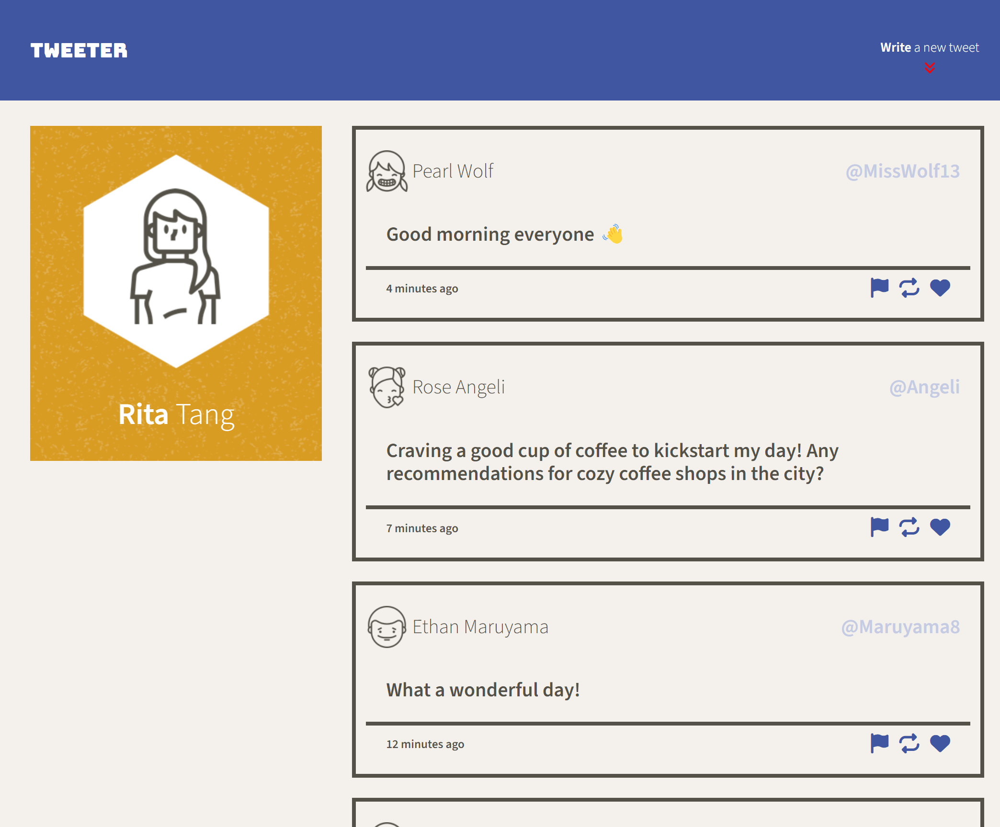
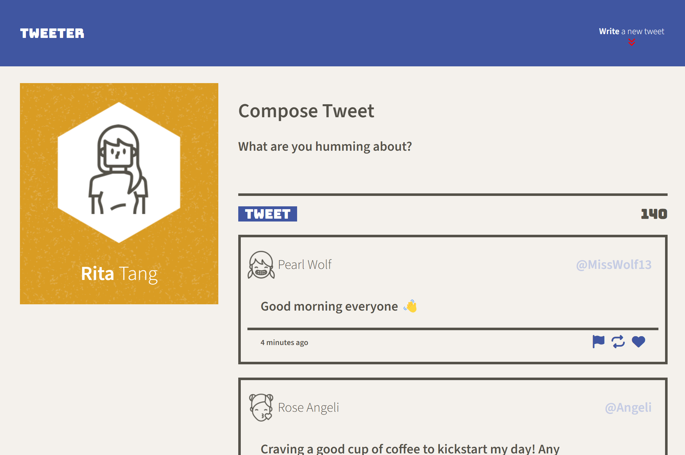

# Tweeter Project

Tweeter is a simple, single-page Twitter clone that is built with HTML5, Sass, JS, jQuery and AJAX for the front-end and Node, Express for the back-end. This project has implemented additional features, including the ability to toggle the Compose Tweet box open or close using the compose button, and displaying a 'Go to Top' button when a user scrolls.

## Final Product

- Mobile Design

 

- Desktop Design

## Dependencies

- Express
- body-parser
- chance

## Getting Started

1. Install dependencies using the `npm install` command.
2. Start the web server using the `npm run local` command. The app will be served at <http://localhost:8080/>.
3. Go to <http://localhost:8080/> in your browser.
